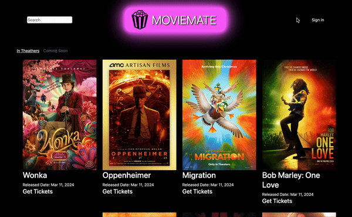
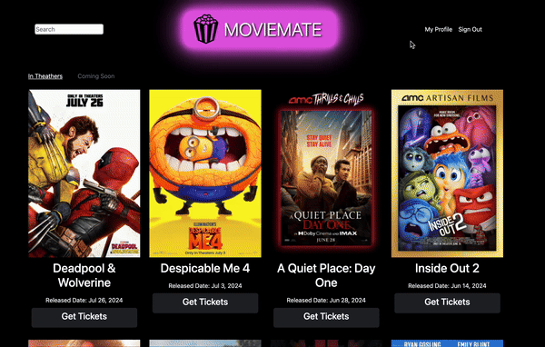

# MovieMate Ticketing

Welcome to the Fullstack MovieMate Ticketing Project! This guide will help you set up and run the project on your local machine.

## Table of Contents

- [Functionalities](#functionalities)
- [Prerequisites](#prerequisites)
- [Installation](#installation)
  - [Clone the Repository](#clone-the-repository)
  - [Install Dependencies](#install-dependencies)
  - [Set Up the Database](#set-up-the-database)
    - [Using Docker](#using-docker)
    - [Connecting to MySQL in Docker](#connecting-to-mysql-in-docker)
    - [Import the Backup File](#import-the-backup-file)
  - [Set Up Environment Variables](#set-up-environment-variables)
  - [Running the Project](#running-the-project)
    - [Start the Backend Server](#start-the-backend-server)
    - [Start the Frontend Server](#start-the-frontend-server)

## Functionalities





## Prerequisites

Before you begin, make sure you have the following software installed on your machine:

- **Node.js** (<https://nodejs.org/>)
- **npm** (<https://www.npmjs.com/>)
- **Angular CLI** (<https://angular.io/cli>)
- **MySQL** (<https://www.mysql.com/>)
- **Java JDK** (<https://www.oracle.com/java/technologies/javase-jdk11-downloads.html>)
- **Maven** (<https://maven.apache.org/>)
- **Git** (<https://git-scm.com/>)
- **Docker Desktop** (<https://www.docker.com/products/docker-desktop>)
- **MySQL Workbench** (<https://www.mysql.com/products/workbench/>) (optional)

## Installation

### Clone the Repository

```bash
git clone https://github.com/damlaSevinc/MovieMate-Ticketing.git
cd MovieMate-Ticketing
```

### Install Dependencies

```bash
cd frontend
npm install
```

### Set Up the Database

#### Using Docker

Pull the MySQL Docker Image:

```bash
docker pull mysql:latest
```

Run the MySQL Docker Container:

```bash
docker run --name movie_mate -e MYSQL_ROOT_PASSWORD=root -e MYSQL_DATABASE=movie_mate -e MYSQL_USER=movie_mate_user -e MYSQL_PASSWORD=movie_mate_pass -d mysql:latest
```

#### Connecting to MySQL in Docker

(optional with MySQL Workbench)

**If you use Workbench, launch MySQLWorkbench and set up a new connection**:

- **Hostname**: `localhost` or `127.0.0.1`
- **Port**: `3306`
- **Username**: `movie_mate_user`
- **Password**: `movie_mate_pass`

- **Test the connection**:
- Click on the `Test Connection` button to ensure the connection is successful

#### Import the Backup File

- Run the following command in your terminal to import the from the schema and data

```bash
docker exec -i movie_mate_mysql mysql -u movie_mate_user -p movie_mate_pass movie_mate < db/backup.sql
```

- Or import through MySQLWorkbench using the following path `db/backup.sql`

- **Verify Import**: Check your MySQL Server to ensure the database has been populated with the necessary tables and data

### Set up environment variables

- Review `application.yml` file located in the `backend/src/main/resources` directory
- Ensure it contains the following database credentials for your local setup

```yaml
spring.datasource.url=jdbc:mysql://localhost:3306/movie_mate
spring.datasource.username=movie_mate_user
spring.datasource.password=movie_mate_pass
```

- Replace `movie_mate_user` and `movie_mate_pass` with your MySQL username and password if necessary

### Running the project

#### Start the backend server

```bash
cd backend
mvn spring-boot:run
```

#### Start the frontend server

```bash
cd frontend
ng serve -o
```

Or run:

```bash
ng serve
```

Then navigate to `http://localhost:4200/` in your browser.
